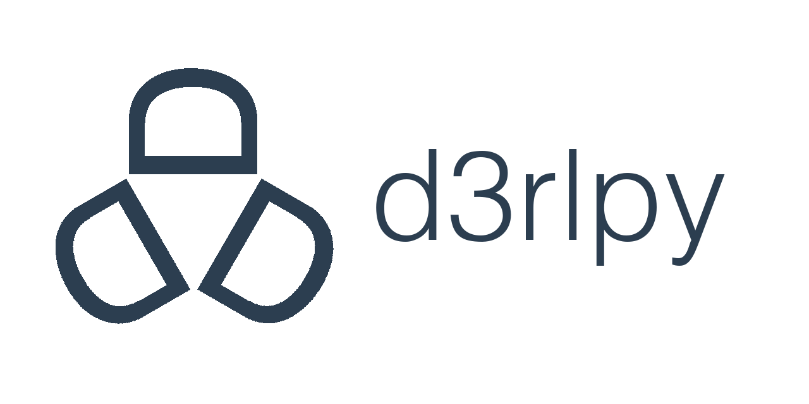
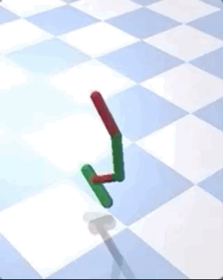

<p align="center"></p>

# d3rlpy: An offline deep reinforcement learning library


[](https://d3rlpy.readthedocs.io/en/latest/?badge=latest)
[](https://codecov.io/gh/takuseno/d3rlpy)
[](https://codeclimate.com/github/takuseno/d3rlpy/maintainability)
[](https://gitter.im/d3rlpy/d3rlpy)


d3rlpy is an offline deep reinforcement learning library for practitioners and researchers.

```py
import d3rlpy

dataset, env = d3rlpy.datasets.get_dataset("hopper-medium-v0")

# prepare algorithm
sac = d3rlpy.algos.SAC()

# train offline
sac.fit(dataset, n_steps=1000000)

# train online
sac.fit_online(env, n_steps=1000000)

# ready to control
actions = sac.predict(x)
```

Documentation: https://d3rlpy.readthedocs.io

## key features

### :zap: Most Practical RL Library Ever
- **offline RL**: d3rlpy supports state-of-the-art offline RL algorithms. Offline RL is extremely powerful when the online interaction is not feasible during training (e.g. robotics, medical).
- **online RL**: d3rlpy also supports conventional state-of-the-art online training algorithms without any compromising, which means that you can solve any kinds of RL problems only with `d3rlpy`.
- **advanced engineering**: d3rlpy is designed to implement the faster and efficient training algorithms. For example, you can train Atari environments with x4 less memory space and as fast as the fastest RL library.

### :beginner: Easy-To-Use API
- **zero-knowledge of DL library**: d3rlpy provides many state-of-the-art algorithms through intuitive APIs. You can become a RL engineer even without knowing how to use deep learning libraries.
- **scikit-learn compatibility**: d3rlpy is not only easy, but also completely compatible with scikit-learn API, which means that you can maximize your productivity with the useful scikit-learn's utilities.

### :rocket: Beyond State-Of-The-Art
- **distributional Q function**: d3rlpy is the first library that supports distributional Q functions in the all algorithms. The distributional Q function is known as the very powerful method to achieve the state-of-the-performance.
- **many tweek options**: d3rlpy is also the first to support N-step TD backup and ensemble value functions in the all algorithms, which lead you to the place no one ever reached yet.


## installation
d3rlpy supports Linux, macOS and Windows.

### PyPI (recommended)
[](https://badge.fury.io/py/d3rlpy)

```
$ pip install d3rlpy
```
### Anaconda
[](https://anaconda.org/conda-forge/d3rlpy)
[](https://anaconda.org/conda-forge/d3rlpy)
[](https://anaconda.org/conda-forge/d3rlpy)
```
$ conda install -c conda-forge d3rlpy
```

### Docker

```
$ docker run -it --gpus all --name d3rlpy takuseno/d3rlpy:latest bash
```

## supported algorithms
| algorithm | discrete control | continuous control | offline RL? |
|:-|:-:|:-:|:-:|
| Behavior Cloning (supervised learning) | :white_check_mark: | :white_check_mark: | |
| [Deep Q-Network (DQN)](https://www.nature.com/articles/nature14236) | :white_check_mark: | :no_entry: | |
| [Double DQN](https://arxiv.org/abs/1509.06461) | :white_check_mark: | :no_entry: | |
| [Deep Deterministic Policy Gradients (DDPG)](https://arxiv.org/abs/1509.02971) | :no_entry: | :white_check_mark: | |
| [Twin Delayed Deep Deterministic Policy Gradients (TD3)](https://arxiv.org/abs/1802.09477) | :no_entry: | :white_check_mark: | |
| [Soft Actor-Critic (SAC)](https://arxiv.org/abs/1812.05905) | :white_check_mark: | :white_check_mark: | |
| [Batch Constrained Q-learning (BCQ)](https://arxiv.org/abs/1812.02900) | :white_check_mark: | :white_check_mark: | :white_check_mark: |
| [Bootstrapping Error Accumulation Reduction (BEAR)](https://arxiv.org/abs/1906.00949) | :no_entry: | :white_check_mark: | :white_check_mark: |
| [Advantage-Weighted Regression (AWR)](https://arxiv.org/abs/1910.00177) | :white_check_mark: | :white_check_mark: | :white_check_mark: |
| [Conservative Q-Learning (CQL)](https://arxiv.org/abs/2006.04779) | :white_check_mark: | :white_check_mark: | :white_check_mark: |
| [Advantage Weighted Actor-Critic (AWAC)](https://arxiv.org/abs/2006.09359) | :no_entry: | :white_check_mark: | :white_check_mark: |
| [Critic Reguralized Regression (CRR)](https://arxiv.org/abs/2006.15134) | :no_entry: | :white_check_mark: | :white_check_mark: |
| [Policy in Latent Action Space (PLAS)](https://arxiv.org/abs/2011.07213) | :no_entry: | :white_check_mark: | :white_check_mark: |
| [TD3+BC](https://arxiv.org/abs/2106.06860) | :no_entry: | :white_check_mark: | :white_check_mark: |

## supported Q functions
- [x] standard Q function
- [x] [Quantile Regression](https://arxiv.org/abs/1710.10044)
- [x] [Implicit Quantile Network](https://arxiv.org/abs/1806.06923)

## other features
Basically, all features are available with every algorithm.

- [x] evaluation metrics in a scikit-learn scorer function style
- [x] export greedy-policy as TorchScript or ONNX
- [x] parallel cross validation with multiple GPU

## experimental features
- Model-based Algorithms
  - [Model-based Offline Policy Optimization (MOPO)](https://arxiv.org/abs/2005.13239)
  - [Conservative Offline Model-Based Policy Optimization (COMBO)](https://arxiv.org/abs/2102.08363)
- Q-functions
  - [Fully parametrized Quantile Function](https://arxiv.org/abs/1911.02140) (experimental)

## benchmark results
d3rlpy is benchmarked to ensure the implementation quality.
The benchmark scripts are available [reproductions](https://github.com/takuseno/d3rlpy/tree/master/reproductions) directory.
The benchmark results are available [d3rlpy-benchmarks](https://github.com/takuseno/d3rlpy-benchmarks) repository.

## examples
### MuJoCo
<p align="center"></p>

```py
import d3rlpy

# prepare dataset
dataset, env = d3rlpy.datasets.get_d4rl('hopper-medium-v0')

# prepare algorithm
cql = d3rlpy.algos.CQL(use_gpu=True)

# train
cql.fit(dataset,
        eval_episodes=dataset,
        n_epochs=100,
        scorers={
            'environment': d3rlpy.metrics.evaluate_on_environment(env),
            'td_error': d3rlpy.metrics.td_error_scorer
        })
```

See more datasets at [d4rl](https://github.com/rail-berkeley/d4rl).

### Atari 2600
<p align="center"></p>

```py
import d3rlpy
from sklearn.model_selection import train_test_split

# prepare dataset
dataset, env = d3rlpy.datasets.get_atari('breakout-expert-v0')

# split dataset
train_episodes, test_episodes = train_test_split(dataset, test_size=0.1)

# prepare algorithm
cql = d3rlpy.algos.DiscreteCQL(n_frames=4, q_func_factory='qr', scaler='pixel', use_gpu=True)

# start training
cql.fit(train_episodes,
        eval_episodes=test_episodes,
        n_epochs=100,
        scorers={
            'environment': d3rlpy.metrics.evaluate_on_environment(env),
            'td_error': d3rlpy.metrics.td_error_scorer
        })
```

See more Atari datasets at [d4rl-atari](https://github.com/takuseno/d4rl-atari).

### PyBullet
<p align="center"></p>

```py
import d3rlpy

# prepare dataset
dataset, env = d3rlpy.datasets.get_pybullet('hopper-bullet-mixed-v0')

# prepare algorithm
cql = d3rlpy.algos.CQL(use_gpu=True)

# start training
cql.fit(dataset,
        eval_episodes=dataset,
        n_epochs=100,
        scorers={
            'environment': d3rlpy.metrics.evaluate_on_environment(env),
            'td_error': d3rlpy.metrics.td_error_scorer
        })
```

See more PyBullet datasets at [d4rl-pybullet](https://github.com/takuseno/d4rl-pybullet).

### Online Training
```py
import d3rlpy
import gym

# prepare environment
env = gym.make('HopperBulletEnv-v0')
eval_env = gym.make('HopperBulletEnv-v0')

# prepare algorithm
sac = d3rlpy.algos.SAC(use_gpu=True)

# prepare replay buffer
buffer = d3rlpy.online.buffers.ReplayBuffer(maxlen=1000000, env=env)

# start training
sac.fit_online(env, buffer, n_steps=1000000, eval_env=eval_env)
```

## tutorials
Try a cartpole example on Google Colaboratory!

- offline RL tutorial: [](https://colab.research.google.com/github/takuseno/d3rlpy/blob/master/tutorials/cartpole.ipynb)
- online RL tutorial: [](https://colab.research.google.com/github/takuseno/d3rlpy/blob/master/tutorials/online.ipynb)

## contributions
Any kind of contribution to d3rlpy would be highly appreciated!
Please check the [contribution guide](CONTRIBUTING.md).

The release planning can be checked at [milestones](https://github.com/takuseno/d3rlpy/milestones).

## community
| Channel | Link |
|:-|:-|
| Chat | [Gitter](https://gitter.im/d3rlpy/d3rlpy) |
| Issues | [GitHub Issues](https://github.com/takuseno/d3rlpy/issues) |

## family projects
| Project | Description |
|:-:|:-|
| [d4rl-pybullet](https://github.com/takuseno/d4rl-pybullet) | An offline RL datasets of PyBullet tasks |
| [d4rl-atari](https://github.com/takuseno/d4rl-atari) | A d4rl-style library of Google's Atari 2600 datasets |
| [MINERVA](https://github.com/takuseno/minerva) | An out-of-the-box GUI tool for offline RL |

## roadmap
The roadmap to the future release is available in [ROADMAP.md](ROADMAP.md).

## citation
```
@misc{seno2020d3rlpy,
  author = {Takuma Seno},
  title = {d3rlpy: An offline deep reinforcement library},
  year = {2020},
  publisher = {GitHub},
  journal = {GitHub repository},
  howpublished = {\url{https://github.com/takuseno/d3rlpy}}
}
```

## acknowledgement
This work is supported by Information-technology Promotion Agency, Japan
(IPA), Exploratory IT Human Resources Project (MITOU Program) in the fiscal
year 2020.
