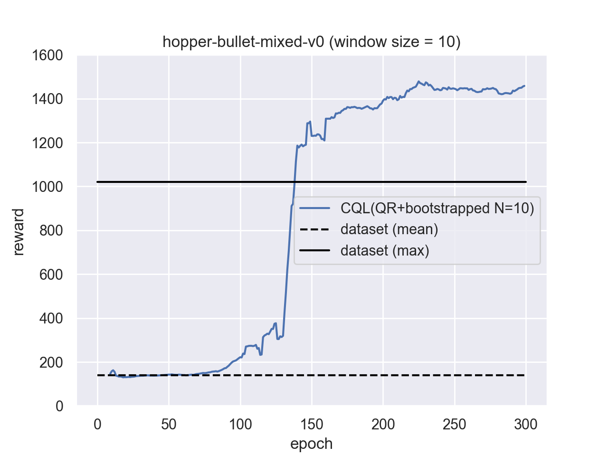

[](https://badge.fury.io/py/d3rlpy)


[](https://d3rlpy.readthedocs.io/en/latest/?badge=latest)
[](https://codecov.io/gh/takuseno/d3rlpy)


# d3rlpy
Data-driven Deep Reinforcement Learning Library as an Out-of-the-box Tool.

```py
from d3rlpy.dataset import MDPDataset
from d3rlpy.algos import BEAR

# MDPDataset takes arrays of state transitions
dataset = MDPDataset(observations, actions, rewards, terminals)

# train data-driven deep RL
bear = BEAR()
bear.fit(dataset.episodes)

# ready to control
actions = bear.predict(x)
```

d3rlpy provides state-of-the-art data-driven deep reinforcement learning
algorithms through out-of-the-box scikit-learn-style APIs.
Unlike other RL libraries, the provided algorithms can achieve extremely
powerful performance beyond the paper via several tweaks.

These are the design principles of d3rlpy:
- d3rlpy is designed for practical projects unlike the many other RL libraries.
- d3rlpy is not focusing on reproducing RL papers.
- d3rlpy is adding more techniques than the original implementations.

Documentation: https://d3rlpy.readthedocs.io

## installation
```
$ pip install d3rlpy
```

## scikit-learn compatibility
This library is designed as if born from scikit-learn.
You can fully utilize scikit-learn's utilities to increase your productivity.
```py
from sklearn.model_selection import train_test_split
from d3rlpy.metrics.scorer import td_error_scorer

train_episodes, test_episodes = train_test_split(dataset)

bear.fit(train_episodes,
         eval_episodes=test_episodes,
         scorers={'td_error': td_error_scorer})
```

You can naturally perform cross-validation.
```py
from sklearn.model_selection import cross_validate

scores = cross_validate(bear, dataset, scoring={'td_error': td_error_scorer})
```

And more.
```py
from sklearn.model_selection import GridSearchCV

gscv = GridSearchCV(estimator=bear,
                    param_grid={'actor_learning_rate': np.arange(1, 10) * 1e-3},
                    scoring={'td_error': td_error_scorer},
                    refit=False)
gscv.fit(train_episodes)
```

## supported algorithms
| algorithm | discrete control | continuous control | data-driven RL? |
|:-|:-:|:-:|:-:|
| Behavior Cloning (supervised learning) | :white_check_mark: | :white_check_mark: | |
| [Deep Q-Network (DQN)](https://www.nature.com/articles/nature14236) | :white_check_mark: | :no_entry: | |
| [Double DQN](https://arxiv.org/abs/1509.06461) | :white_check_mark: | :no_entry: | |
| [Deep Deterministic Policy Gradients (DDPG)](https://arxiv.org/abs/1509.02971) | :no_entry: | :white_check_mark: | |
| [Twin Delayed Deep Deterministic Policy Gradients (TD3)](https://arxiv.org/abs/1802.09477) | :no_entry: | :white_check_mark: | |
| [Soft Actor-Critic (SAC)](https://arxiv.org/abs/1812.05905) | :no_entry: | :white_check_mark: | |
| [Random Ensemble Mixture (REM)](https://arxiv.org/abs/1907.04543) | :construction: | :no_entry: | :white_check_mark: |
| [Batch Constrained Q-learning (BCQ)](https://arxiv.org/abs/1812.02900) | :white_check_mark: | :white_check_mark: | :white_check_mark: |
| [Bootstrapping Error Accumulation Reduction (BEAR)](https://arxiv.org/abs/1906.00949) | :no_entry: | :white_check_mark: | :white_check_mark: |
| [Advantage-Weighted Regression (AWR)](https://arxiv.org/abs/1910.00177) | :construction: | :construction: | :white_check_mark: |
| [Advantage-weighted Behavior Model (ABM)](https://arxiv.org/abs/2002.08396) | :construction: | :construction: | :white_check_mark: |
| [Conservative Q-Learning (CQL)](https://arxiv.org/abs/2006.04779) (recommended) | :white_check_mark: | :white_check_mark: | :white_check_mark: |

## supported Q functions
- [x] standard Q function
- [x] [Quantile Regression](https://arxiv.org/abs/1710.10044)
- [x] [Implicit Quantile Network](https://arxiv.org/abs/1806.06923)
- [x] [Fully parametrized Quantile Function](https://arxiv.org/abs/1911.02140) (experimental)

## other features
Basically, all features are available with every algorithm.

- [x] evaluation metrics in a scikit-learn scorer function style
- [x] embedded preprocessors
- [x] ensemble Q function with bootstrapping
- [x] [delayed policy updates](https://arxiv.org/abs/1802.09477)
- [x] parallel cross validation with multiple GPU
- [x] online training
- [x] [Model-based Offline Policy Optimization](https://arxiv.org/abs/2005.13239) (experimental)
- [ ] user-defined custom network
- [ ] automatic image augmentation

## examples
### Atari 2600
```py
from d3rlpy.datasets import get_atari
from d3rlpy.algos import DiscreteCQL
from d3rlpy.metrics.scorer import evaluate_on_environment
from d3rlpy.metrics.scorer import discounted_sum_of_advantage_scorer
from sklearn.model_selection import train_test_split

# get data-driven RL dataset
dataset, env = get_atari('breakout-expert-v0')

# split dataset
train_episodes, test_episodes = train_test_split(dataset, test_size=0.2)

# setup algorithm
cql = DiscreteCQL(n_epochs=100,
                  n_critics=3,
                  bootstrap=True,
                  q_func_type='qr',
                  scaler='pixel',
                  use_gpu=True)

# start training
cql.fit(train_episodes,
        eval_episodes=test_episodes,
        scorers={
            'environment': evaluate_on_environment(env),
            'advantage': discounted_sum_of_advantage_scorer
        })
```
| performance | demo |
|:-:|:-:|
|||

See more Atari datasets at [d4rl-atari](https://github.com/takuseno/d4rl-atari).

### PyBullet
```py
from d3rlpy.datasets import get_pybullet
from d3rlpy.algos import CQL
from d3rlpy.metrics.scorer import evaluate_on_environment
from d3rlpy.metrics.scorer import discounted_sum_of_advantage_scorer
from sklearn.model_selection import train_test_split

# get data-driven RL dataset
dataset, env = get_pybullet('hopper-bullet-mixed-v0')

# split dataset
train_episodes, test_episodes = train_test_split(dataset, test_size=0.2)

# setup algorithm
cql = CQL(n_epochs=300,
          n_critics=10,
          bootstrap=True,
          update_actor_interval=2,
          q_func_type='qr',
          use_gpu=True)

# start training
cql.fit(train_episodes,
        eval_episodes=test_episodes,
        scorers={
            'environment': evaluate_on_environment(env),
            'advantage': discounted_sum_of_advantage_scorer
        })
```
| performance | demo |
|:-:|:-:|
|||


See more PyBullet datasets at [d4rl-pybullet](https://github.com/takuseno/d4rl-pybullet).

## Tutorials
Try a cartpole example on Google Colaboratory!

[](https://colab.research.google.com/github/takuseno/d3rlpy/blob/master/tutorials/cartpole.ipynb)


## contributions
### coding style
This library is fully formatted with [yapf](https://github.com/google/yapf).
You can format the entire scripts as follows:
```
$ ./scripts/format
```

### test
The unit tests are provided as much as possible.
This repository is using `pytest-cov` instead of `pytest`.
You can run the entire tests as follows:
```
$ ./scripts/test
```

If you give `-p` option, the performance tests with toy tasks are also run
(this will take minutes).
```
$ ./scripts/test -p
```

## acknowledgement
This work is supported by Information-technology Promotion Agency, Japan
(IPA), Exploratory IT Human Resources Project (MITOU Program) in the fiscal
year 2020.
