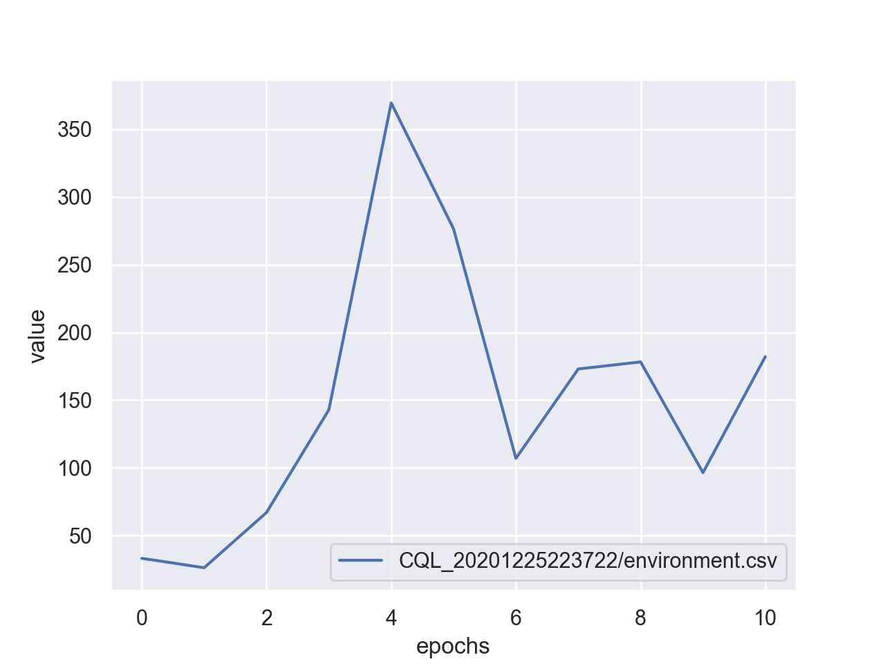
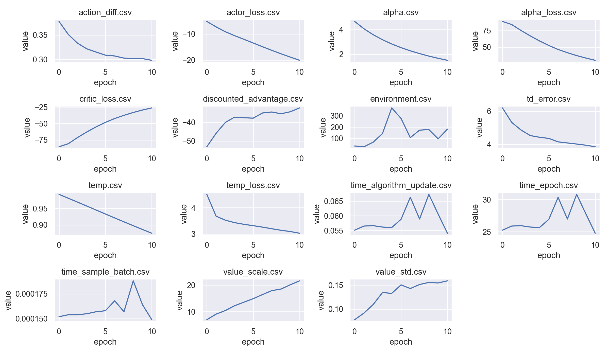

Command Line Interface
======================

d3rlpy provides the convenient CLI tool.

plot
----

Plot the saved metrics by specifying paths::

  $ d3rlpy plot <path> [<path>...]

.. list-table:: options
   :header-rows: 1

   * - option
     - description
   * - ``--window``
     - moving average window.
   * - ``--show-steps``
     - use iterations on x-axis.
   * - ``--show-max``
     - show maximum value.
   * - ``--label``
     - label in legend.
   * - ``--xlim``
     - limit on x-axis (tuple).
   * - ``--ylim``
     - limit on y-axis (tuple).
   * - ``--title``
     - title of the plot.
   * - ``--save``
     - flag to save the plot as an image.

example::

  $ d3rlpy plot d3rlpy_logs/CQL_20201224224314/environment.csv

plot-all
--------

Plot the all metrics saved in the directory::

  $ d3rlpy plot-all <path>

example::

  $ d3rlpy plot-all d3rlpy_logs/CQL_20201224224314

export
------

Export the saved model to the inference format, ONNX (``.onnx``) and TorchScript (``.pt``)::

  $ d3rlpy export <model_path> <out_path>

example::

  $ d3rlpy export d3rlpy_logs/CQL_20201224224314/model_100.d3 policy.onnx

record
------

Record evaluation episodes as videos with the saved model::

  $ d3rlpy record <path> --env-id <environment id>

.. list-table:: options
   :header-rows: 1

   * - option
     - description
   * - ``--env-id``
     - Gym environment id.
   * - ``--env-header``
     - Arbitrary Python code to define environment to evaluate.
   * - ``--out``
     - Output directory.
   * - ``--n-episodes``
     - The number of episodes to record.
   * - ``--frame-rate``
     - Video frame rate.
   * - ``--record-rate``
     - Images are recored every ``record-rate`` frames.
   * - ``--epsilon``
     - :math:`\epsilon`-greedy evaluation.
   * - ``--target-return``
     - The target environment return for Decision Transformer algorithms.

example::

  # record simple environment
  $ d3rlpy record d3rlpy_logs/CQL_20201224224314/model_100.d3 --env-id HopperBulletEnv-v0

  # record wrapped environment
  $ d3rlpy record d3rlpy_logs/Discrete_CQL_20201224224314/model_100.d3 \
      --env-header 'import gym; from d3rlpy.envs import Atari; env = Atari(gym.make("BreakoutNoFrameskip-v4"), is_eval=True)'

play
----

Run evaluation episodes with rendering::

  $ d3rlpy play <path> --env-id <environment id>

.. list-table:: options
   :header-rows: 1

   * - option
     - description
   * - ``--env-id``
     - Gym environment id.
   * - ``--env-header``
     - Arbitrary Python code to define environment to evaluate.
   * - ``--n-episodes``
     - The number of episodes to run.
   * - ``--target-return``
     - The target environment return for Decision Transformer algorithms.

example::

  # record simple environment
  $ d3rlpy play d3rlpy_logs/CQL_20201224224314/model_100.d3 --env-id HopperBulletEnv-v0

  # record wrapped environment
  $ d3rlpy play d3rlpy_logs/Discrete_CQL_20201224224314/model_100.d3 \
      --env-header 'import gym; from d3rlpy.envs import Atari; env = Atari(gym.make("BreakoutNoFrameskip-v4"), is_eval=True)'
