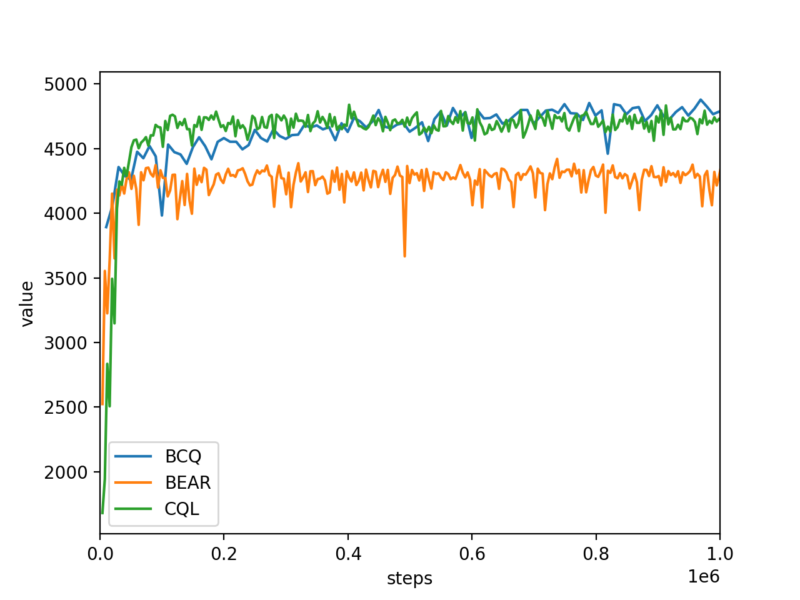
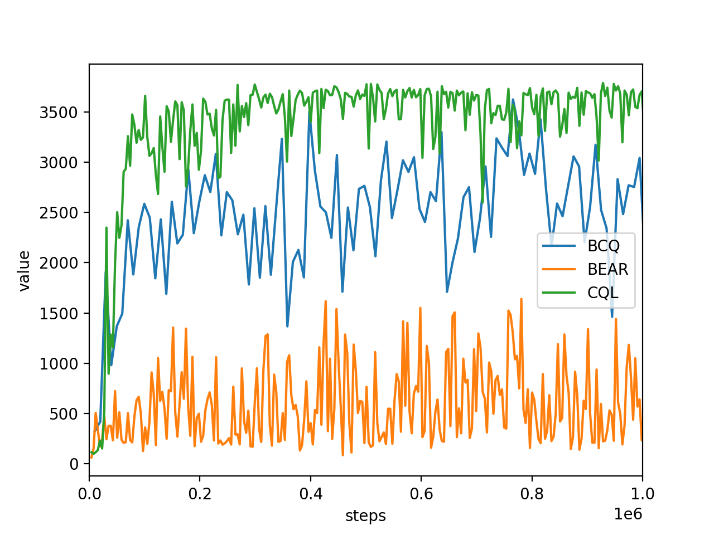
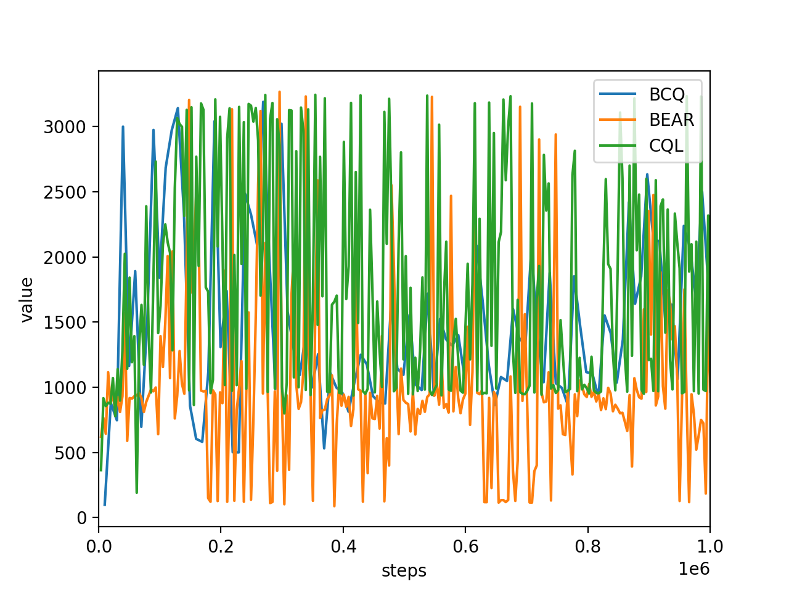

Paper Reproductions
-------------------

For the experiment code, please take a look at
`reproductions <https://github.com/takuseno/d3rlpy/tree/master/reproductions>`_ directory.

Offline
~~~~~~~

`Fu et al., D4RL: Datasets for Deep Data-Driven Reinforcement Learning. <https://arxiv.org/abs/2004.07219>`_

halfcheetah-medium-v0
================

walker2d-medium-v0
================

hopper-medium-v0
================

Online
~~~~~~

TBD.
