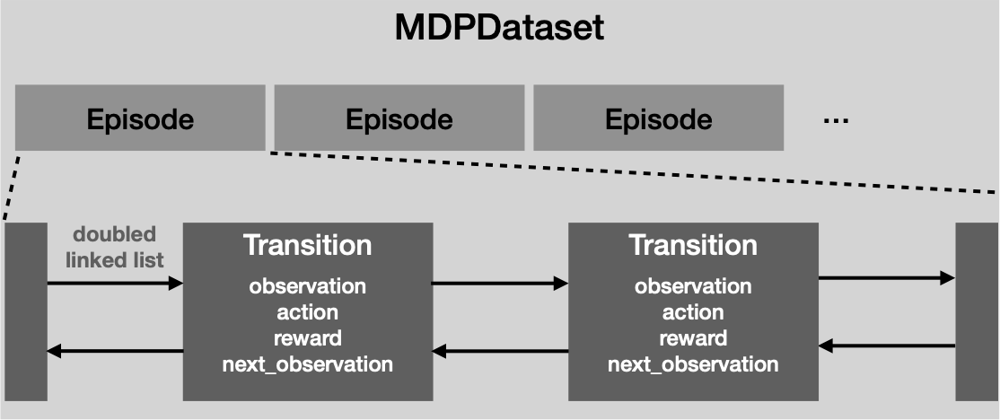
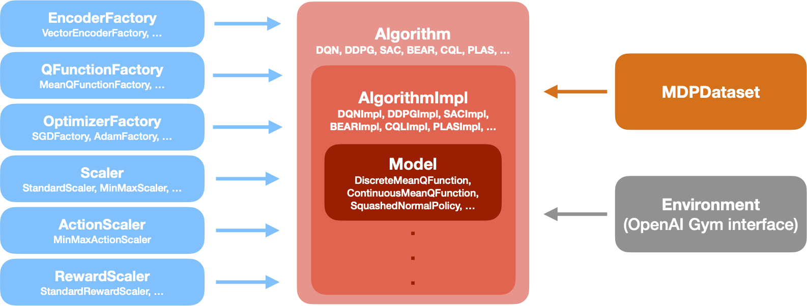

***************
Software Design
***************

In this page, the software design of d3rlpy is explained.

MDPDataset
----------

``MDPDataset`` is a dedicated dataset structure for offline RL.
``MDPDataset`` automatically structures dataset based on ``Episode`` and
``Transition``.
``Episode`` represents a single episode that includes multiple ``Transition``
objects collected in the episode.
``Transition`` represents a single tuple experience that consists of
``observation``, ``action``, ``reward`` and ``next_observation``.

The advantage of this design is that you can split train and test datasets in
an episode-wise manner.
This feature is specifically useful for the offline RL training since holding
out a continuous sequence of data is more making sense unlike a non-sequetial
supervised training such as ImageNet classification models.

Regarding the engineering perspective, the underlying transition data is
implemented by Cython, a Python-like language compiled to C language, to
reduce the computational costs for the memory copies.
This Cythonized implementation especially speeds up the cumulative returns
for multi-step learning and frame-stacking for pixel observations.

Please check :doc:`tutorials/play_with_mdp_dataset` for the tutorial and
:doc:`references/dataset` for the API reference.

Algorithm
---------

The implemented algorithms are designed as above.
The algorithm objects have a hierarchical structure where ``Algorithm``
provides the high-level API (e.g. ``fit`` and ``fit_online``) for users and
``AlgorithmImpl`` provides the low-level API (e.g. ``update_actor`` and
``update_critic``) used in the high-level API.
The advantage of this design is to maximize the reusability of algorithm
logics.
For example, `delayed policy update` proposed in TD3 reduces the update
frequency of the policy function.
This mechanism can be implemented by changing the frequency of ``update_actor``
method calls in ``Algorithm`` layer without changing the underlying logics.

``Algorithm`` class takes multiple components that configure the training.
These are the links to the API reference.

.. list-table:: Algorithm Components

   * - Name
     - Reference
   * - Algorithm
     - :doc:`references/algos`
   * - EncoderFactory
     - :doc:`references/network_architectures`
   * - QFunctionFactory
     - :doc:`references/q_functions`
   * - OptimizerFactory
     - :doc:`references/optimizers`
   * - Scaler
     - :doc:`references/preprocessing`
   * - ActionScaler
     - :doc:`references/preprocessing`
   * - RewardScaler
     - :doc:`references/preprocessing`
