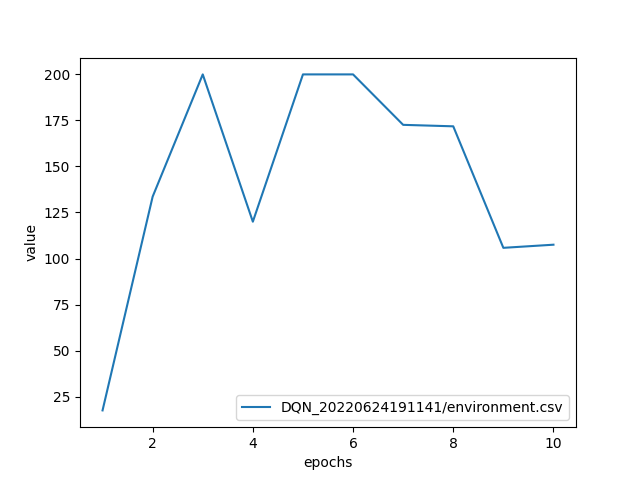
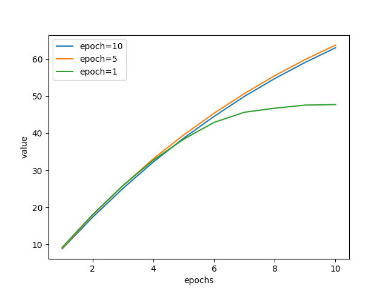
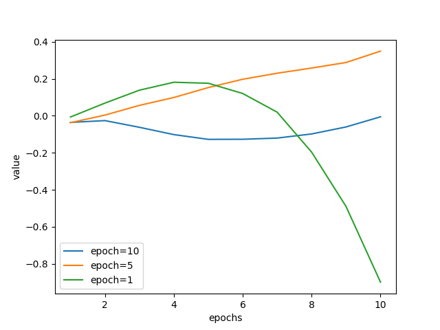

************************
Offline Policy Selection
************************

d3rlpy supports offline policy selection by training Fitted Q Evaluation (FQE), which is an offline on-policy RL algorithm.
The use of FQE for offline policy selection is proposed by `Paine et al. <https://arxiv.org/abs/2007.09055>`_.
The concept is that FQE trains Q-function with the trained policy in on-policy manner so that the learned Q-function reflects the expected return of the trained policy.
By using the Q-value estimation of FQE, the candidate trained policies can be ranked only with offline dataset.
Check :doc:`../references/off_policy_evaluation` for more information.

.. note::

  Offline policy selection with FQE is confirmed that it usually works out with discrete action-space policies.
  However, it seems require some hyperparameter tuning for ranking continuous action-space policies.
  The more techniques will be supported along with the advancement of this research domain.

Prepare trained policies
------------------------

In this tutorial, let's train DQN with the built-in CartPole-v0 dataset.

.. code-block:: python

   import d3rlpy

   # setup replay CartPole-v0 dataset and environment
   dataset, env = d3rlpy.datasets.get_dataset("cartpole-replay")

   # setup algorithm
   dqn = d3rlpy.algos.DQNConfig().create()

   # start offline training
   dqn.fit(
      dataset,
      n_steps=100000,
      n_steps_per_epoch=10000,
      scorers={
          "environment": d3rlpy.metrics.EnvironmentEvaluator(env),
      },
   )

Here is the example result of online evaluation.

Train FQE with the trained policies
-----------------------------------

Next, we train FQE algorithm with the trained policies.
Please note that we use ``initial_state_value_estimation_scorer`` and ``soft_opc_scorer`` proposed in `Paine et al. <https://arxiv.org/abs/2007.09055>`_.
``initial_state_value_estimation_scorer`` computes the mean action-value estimation at the initial states.
Thus, if this value for a certain policy is bigger than others, the policy is expected to obtain the higher episode return.
On the other hand, ``soft_opc_scorer`` computes the mean difference between the action-value estimation for the success episodes and the action-value estimation for the all episodes.
If this value for a certain policy is bigger than others, the learned Q-function can clearly tell the difference between the success episodes and others.

.. code-block:: python

   import d3rlpy

   # setup the same dataset used in policy training
   dataset, _ = d3rlpy.datasets.get_dataset("cartpole-replay")

   # load pretrained policy
   dqn = d3rlpy.load_learnable("d3rlpy_logs/DQN_20220624191141/model_100000.d3")

   # setup FQE algorithm
   fqe = d3rlpy.ope.DiscreteFQE(algo=dqn, config=d3rlpy.ope.DiscreteFQEConfig())

   # start FQE training
   fqe.fit(
      dataset,
      n_steps=10000,
      n_steps_per_epoch=1000,
      scorers={
          "init_value": d3rlpy.metrics.InitialStateValueEstimationEvaluator(),
          "soft_opc": d3rlpy.metrics.SoftOPCEvaluator(180),  # set 180 for success return threshold here
      },
   )

In this example, the policies from epoch 10, epoch 5 and epoch 1 (evaluation episode returns of 107.5, 200.0 and 17.5 respectively) are compared.
The first figure represents the ``init_value`` metrics during FQE training.
As you can see here, the scale of ``init_value`` has correlation with the ranks of evaluation episode returns.

The second figure represents the ``soft_opc`` metrics during FQE training.
These curves also have correlation with the ranks of evaluation episode returns.

Please note that there is usually no convergence in offline RL training due to the non-fixed bootstrapped target.
